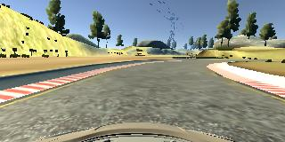

# **Behavioral Cloning** 


---

**Behavioral Cloning Project**

The goals / steps of this project are the following:
* Use the simulator to collect data of good driving behavior
* Implement a neural network architecture based on the Nvidia model in Keras to predict steering angle from images.
* Train and validate the model with a training and validation set
* Test that the model successfully drives around track one without leaving the road
* Summarize the results with a written report


[//]: # (Image References)

[image1]: ./examples/placeholder.png "Model Visualization"
[image2]: ./examples/placeholder.png "Grayscaling"
[image3]: ./examples/placeholder_small.png "Recovery Image"
[image4]: ./examples/placeholder_small.png "Recovery Image"
[image5]: ./examples/placeholder_small.png "Recovery Image"
[image6]: ./examples/placeholder_small.png "Normal Image"
[image7]: ./examples/placeholder_small.png "Flipped Image"

## Rubric Points
### Here I will consider the [rubric points](https://review.udacity.com/#!/rubrics/432/view) individually and describe how I addressed each point in my implementation.  

---
### Files Submitted & Code Quality

#### 1. Submission includes all required files and can be used to run the simulator in autonomous mode

My project includes the following files:
* model.py - top level script containing the main method. Makes calls to methods declared in other files below.
* cloning_models.py - Implements a simple NN, Lenet, Nvidia and a ELU based model. The best model is the Nvidia model.
* augmentation.py - Code to augment the input training set. It primarily flips the left, center and right images.
* generator.py - Contains generator code used to generate batches of data. This enables the model to be run on very large datasets.
* sampler.py - Contains code to break up the training set into 25 buckets. Downsamples buckets which have a lot of examples to prevent model from overfitting to these classes.  
* drive.py - for driving the car in autonomous mode
* model.h5 - containing a trained convolution neural network 
* writeup_report.md - summarizing the results
* train_steering.png - Scatter plot of error vs expected training values. The network seems to under predict the values most of the time.
* sample_scatter_3_.png - Shows the distribution of number of training examples in the 25 buckets. Its clear that three of the buckets are heavily skewed

#### 2. Submission includes functional code
Using the Udacity provided simulator and my drive.py file, the car can be driven autonomously around the track by executing 
```sh
python drive.py model.h5
```

#### 3. Submission code is usable and readable

The model.py file contains the code for training and saving the convolution neural network. It is a top level script which does the following.
* Parse command line arguments.
* Based on the input arguments, chooses a model to train.
* Augments the training set by flipping the left, middle and right
  images horizontally and using the negative of the steering value.
* Splits the training set into 25 buckets. The distribution shows that
  three buckets dominate and others have much fewer examples. Down samples
  the three frequent ones so that model does not give undue importance
  to those.
* Creates a generator and uses it to load the training and validation set
  in batches.
* Trains the model and saves it.

### Model Architecture and Training Strategy

#### 1. An appropriate model architecture has been employed

My model is based on the model proposed by Nvidia (cloning_models.py lines 57-72). The model is described in detail [here](https://images.nvidia.com/content/tegra/automotive/images/2016/solutions/pdf/end-to-end-dl-using-px.pdf). 

The model first normalizes the input (cloning_models.py line 10) using a Keras lambda layer. It also crops a part of the top of the image (cloning_models.py line 11). This is followed by five convolutional layers (cloning_models.py line 60-64) and a flatten layer. Lastly, there are four dense layers (cloning_models.py lines 67-70). All the convolutional layers include the RELU activation.
 

#### 2. Attempts to reduce overfitting in the model

Data augmentation was used to reduce overfitting of the model. For each image in the training set (left, center or right), an augmented image was generated by flipping the image horizontally and negating the steering value. (augmentation.py lines 17-45). 

In addition to the data provided by the udacity team, I generated additional data on my own. In this data, I drove the car in the opposite
direction to the normal direction so that the model could generalize better.

One of the key changes I had to make to the training for the model to
perform well was down sampling. I split the training examples into 25
buckets based on the expected value of the steering in the training set.
It showed a clear skewed dataset where there were three modes. I hypothesized that the model was overfitting on these majority buckets. I thus downsampled some of these modal buckets and the model improved substantially (it drove the track without problems).

Another thing I did was to try to teach the model to recover when the car is about to veer off the road. I did this by driving towards the edge of the lane in both directions then correcting to the center.

All of the above techniques played a part in improving the model and reducing overfitting.

#### 3. Model parameter tuning

The model used an adam optimizer, so the learning rate was not tuned manually (model.py line 25).

#### 4. Appropriate training data

Training data was chosen to keep the vehicle driving on the road. I used a combination of center lane driving, recovering from the left and right sides of the road ... 

For details about how I created the training data, see the next section. 

### Model Architecture and Training Strategy

#### 1. Solution Design Approach

The overall strategy for deriving a model architecture was to start exploring simple models and progressively iterate to try out more complex ones. I setup the training pipeline setup to make it easier to experiment with different model types. The candidate models I had in mind were MLP, Lenet and the Nvidia model. I tried the simpler models (single layer NN and Lenet) first to get more familiar with the overall training and testing flow. For Lenet, I tried additional variants of the standard architecture by adding more layers, trying out wider networks etc to understand how the model did as I changed these parameters. With these simple models, I was about to make some headway but could not get the car to drive around the track for a complete lap.

I then decided to implement the Nvidia architecture recommended by the instructor and see if that would help. Initially I trained on just the data provided by Udacity and see how far I could go with that. I first trained using only the center image, then enhanced the training pipeline to also train on the left and right images. That helped slightly but still I could not get the car to drive across the full lap. The car would veer off the road during turns and also in areas which were different - bridge, area where the lane was not marked (there was a muddy patch on the right) and areas where the curve was too sharp. 

I struggled a lot to make progress at that time and then I started to collect more data. I collected data for two additional laps. Having not played video games at all in my life, I struggled quite a bit during the data collection phase. The model did not improve much and I was thinking that my lack of skil in capturing data (I was using the keys to get the car to turn) could be a factor. 

At that point I thought of analyzing my data and the errors which my best model till that point was making. I realized that the errors were much more prominent for cases where the expected steering values were large. Then I though of digging into it further and thought of looking at the distribution of steering values in the training set. I broke up the steering range of [-1, 1] into 25 buckets and looked at the distribution of the examples in those buckets. To my surprise, this was a distribution with three major peaks. Please look at distribution: 
. Based on the distribution, I conjectured that the dominant distributions might be causing the model to overfit to the three modes and might be hard for the model to effectively learn from the other examples. Based on this, I wrote a Sampler class (sampler.py) which downsamples the buckets which occur more frequently than the average s.t. all classes have about the average number of examples. It does not sample classes which have fewer than the average number of examples. In addition, I also collected additional examples where I trained the model to recover when it is about to veer off the track. In the simulator I drove towards the edge of the lane and then corrected (both sides). I also collected data for the track in the opposite direction so that the model generalizes better.


At the end of the process, the vehicle is able to drive autonomously around the track without leaving the road.

#### 2. Final Model Architecture

My model is based on the model proposed by Nvidia (cloning_models.py lines 57-72). The model is described in detail [here](https://images.nvidia.com/content/tegra/automotive/images/2016/solutions/pdf/end-to-end-dl-using-px.pdf). 

The input is trained using the image pixel values as features and the expected steering values as the output. It is a regression model, which learns a continuous output (steering values). The metric to optimize is the MSE (mean square error) between the expected steering output and the prediction of the model.

The model is implemented in cloning_models.py (lines 56-70). It does the following
* Normalizes the input (cloning_models.py line 10) using a Keras lambda layer.
* Crops a part of the top of the image (cloning_models.py line 11).
* Has five convolution layers (cloning_models.py line 60-64). Each convolutional layers include the RELU activation which is the key non-linear operation.
* A flatten layer (cloning_models.py line 65).
* Four dense layers (cloning_models.py lines 67-70)
* The optimization metric is 'mse' and I use the 'adam' optimizer which automatically tunes the learning rate (model.py line 111).
* The training and validation is done in batches and I use a generator to generate the training and validation batches. This enables the model to handle large training examples as only a portion of the images need to be in memory at a given time. The generator logic is implemented in generator.py and is invoked in model.py (line 128).
* The training and validation sets are shuffled before generation of each batch (generator.py line 29) to avoid dependencies between examples in a batch.

Here is a visualization of the architecture


#### 3. Creation of the Training Set & Training Process

To capture good driving behavior, I used the data provided by Udacity as the base line. Here is an example of an image provided in the dataset:


I then recorded the vehicle driving in the reverse direction for two laps. An example of an image captured in the reverse direction is:



I then recorded the vehicle recovering from the left side and right sides of the road back to center so that the vehicle would learn to recover if it is trying to veer off the road. These images show what a recovery looks like starting from the vehicle about to veer off the left side of the road:


To augment the data sat, I also flipped images and angles thinking that this would help the model generalize better. For example, here is an image that has then been flipped:


After the collection process, I had 29214 number of training data points. I then preprocessed this data by normalization and cropping the images (cloning_models.py lines 9-12).


I finally randomly shuffled the data set and put 20% of the data into a validation set. My validation set had a size of 7304. 

I used this training data for training the model. The validation set helped determine if the model was over or under fitting. The ideal number of epochs was 3 as evidenced by the validation loss start to increase back again after 3 epochs. I used an adam optimizer so that manually training the learning rate wasn't necessary.